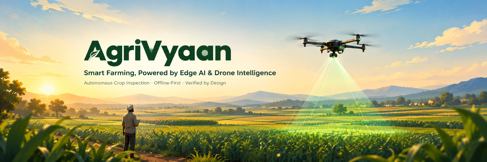
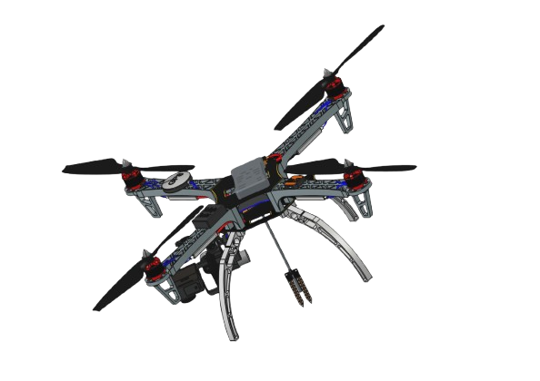
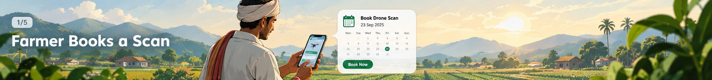
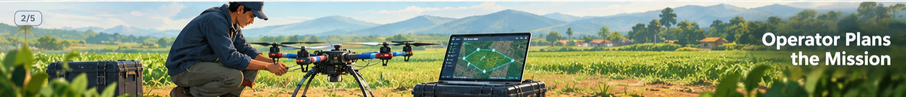
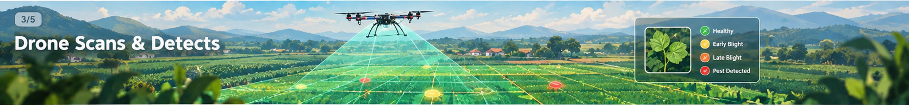
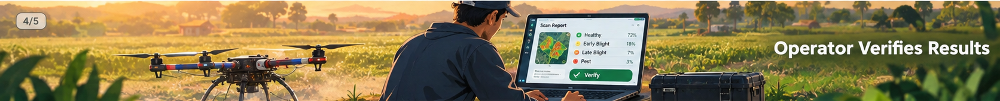
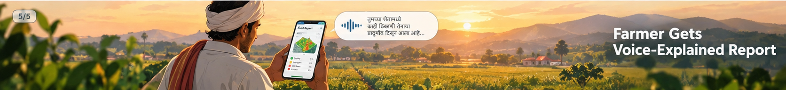
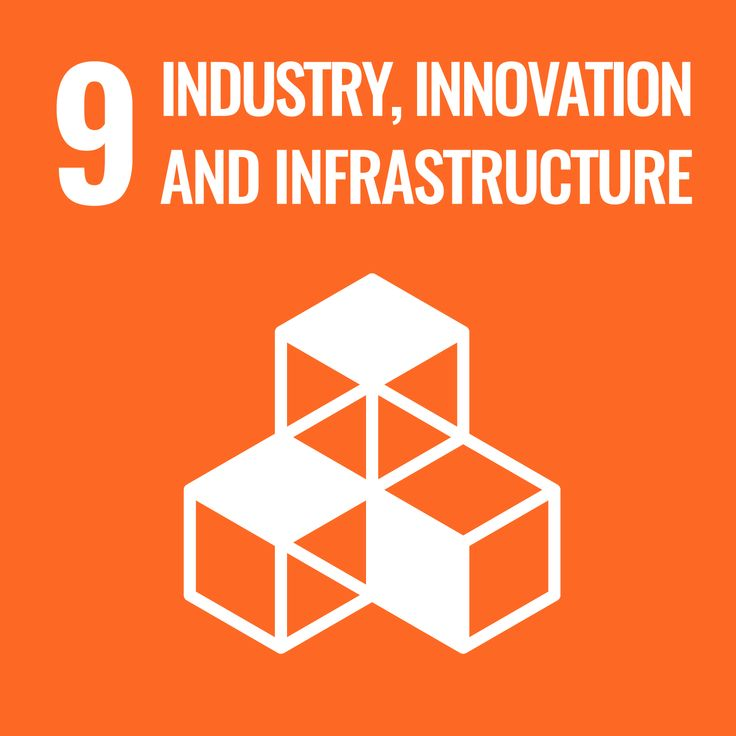
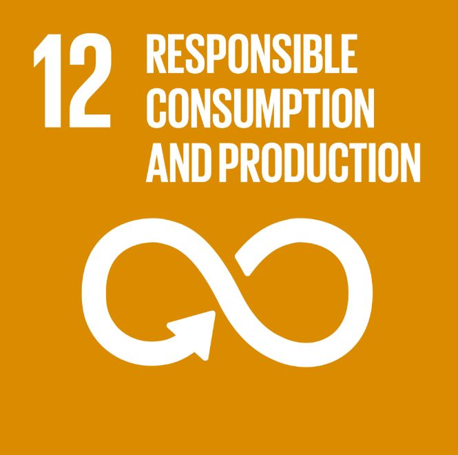

<p align="center">
  
</p>

<h1 align="center">Agri-Vyaan</h1>
<h3 align="center">Smart Farming Assistant — Autonomous Drone Crop Inspection System</h3>

<p align="center">
  
  
</p>

<p align="center">
  <b>Offline-first · Edge-AI · Drone-as-a-Service · Farmer-Centric</b>
</p>

---

## 📖 About the Project

**AgriVyaan** (powered by **AgriSwarm**) is a low-cost, fully offline, two-stage autonomous drone inspection system built for potato crops — designed to bring precision agriculture to smallholder farmers without requiring them to own any hardware.

Farmers simply **book a scan**. A trained operator flies the drone, the onboard Edge-AI pipeline analyzes the field in real time, and the farmer receives a simple, actionable, offline-deliverable report in their own language — no internet, no technical knowledge, no expensive equipment required.

The system is built around three connected applications:

- 🛸 **Drone + Edge AI** — fully autonomous, real-time, on-device field analysis
- 🖥️ **Operator App** — mission planning, flight supervision, verification & reporting
- 📱 **Farmer App (AgriVyaan)** — offline-first, multilingual, voice-guided report & action tracking

---

## 📝 Abstract

Crop diseases, pests, and water stress often go unnoticed until visible damage has already spread across a field — by which point yield loss is difficult to reverse. **AgriVyaan** addresses this by pairing a low-cost autonomous drone with an on-device AI pipeline that scans fields in two passes: a fast full-field sweep to flag areas of concern, followed by a closer, targeted rescan to confirm the issue. Every finding is verified by a human operator before it reaches the farmer, and the farmer's report is delivered offline, in their own language, with clear next steps — turning a technical scan into a simple, trustworthy action plan.

---

## 🚩 Problem Statement

Smallholder and marginal farmers — who make up the majority of India's agricultural workforce — routinely lose crop yield to diseases, pests, water stress, and nutrient deficiencies that go **undetected until it's too late**. Existing precision-agriculture solutions assume farmers can afford their own drones, sensors, smartphones with reliable connectivity, and the technical literacy to interpret raw AI output.

In reality, the biggest barriers to adoption in rural India aren't algorithmic — they are:

- 📶 **Low or no internet connectivity** in the field
- 📚 **Low digital/textual literacy**
- 💰 **Inability to own or maintain precision-ag hardware**
- 🤖 **Low trust in autonomous AI decisions with no human check**

A viable solution has to solve for these constraints first, not just chase marginal gains in detection accuracy.

---

## 💡 Our Idea

AgriVyaan reframes the problem as an **adoption and trust problem**, not purely a detection problem:

- A **shared drone-as-a-service** model removes the hardware ownership barrier entirely
- A **two-stage scan** (coarse full-field pass → targeted close-up rescan) balances speed and accuracy
- **Human-in-the-loop verification** ensures no AI finding reaches a farmer unchecked
- A **fully offline edge pipeline** means the system works even where connectivity never reaches
- A **voice-guided, multilingual farmer app** removes the literacy barrier from onboarding to final report

Every finding the farmer sees is explainable, confidence-labeled, and grounded in real evidence — never a black-box verdict.

---

## 🛸 The Drone

<p align="center">
  
</p>

A lightweight F450-class quadcopter fitted with a high-resolution camera and onboard compute, capable of fully autonomous flight, in-field capture, and real-time on-device analysis — with zero dependency on the cloud.

---

## 🔄 How It Works — 5 Phases

<p align="center">
  
</p>

**Phase 1 — Booking & Field Setup**
The farmer books a scan without needing any GPS or technical knowledge. The operator identifies the field and sets it up for the mission.

<p align="center">
  
</p>

**Phase 2 — Autonomous Full-Field Scan**
The drone autonomously covers the entire field, capturing imagery and sensor data while flagging areas of concern in real time.

<p align="center">
  
</p>

**Phase 3 — Targeted Close-Up Rescan**
Flagged zones are automatically revisited at a lower altitude for high-resolution, close-up disease and pest detection.

<p align="center">
  
</p>

**Phase 4 — Operator Verification & Reporting**
All findings are reviewed and verified by a human operator before being compiled into a farmer-ready report.

<p align="center">
  
</p>

**Phase 5 — Farmer Action & Follow-Up**
The farmer receives an easy-to-understand, voice-explained report, takes recommended action, and tracks improvement over future scans.

---

## ✨ Key Highlights

- 🌐 **100% Offline Edge Pipeline** — the entire detect-to-report loop works with zero internet connectivity
- 🔍 **Two-Stage Inspection** — coarse scan followed by a smart, targeted rescan for efficiency and accuracy
- ✅ **Human-Verified Findings** — every recommendation is checked by an operator before reaching the farmer
- 🗣️ **Voice-Guided Experience** — onboarding and report explanation in the farmer's native language
- 🚁 **Autonomous Soil Sampling** — the drone can land safely to take ground-truth soil readings
- 🔋 **Battery-Aware & Resumable** — missions intelligently plan around battery limits and resume across flights
- 📊 **Explainable by Design** — findings are transparent and evidence-backed, never a black box
- 🔁 **Closed-Loop Tracking** — from problem detection all the way to harvest outcome

---

## 📈 Impact & Benefits

| Impact Area | Benefit |
|---|---|
| 🌾 **Reduced Crop Loss** | Early, precise detection enables intervention before problems spread across the field |
| 💰 **Lower Input Costs** | Zone-level findings support targeted treatment instead of blanket pesticide/fertilizer use |
| 💧 **Water Efficiency** | Smarter irrigation decisions reduce both under- and over-watering |
| 🧑‍🌾 **Accessibility for Smallholders** | Shared drone-as-a-service removes the cost barrier of owning hardware |
| 📶 **Works Anywhere** | Fully functional in low- or zero-connectivity rural regions |
| 🤝 **Builds Trust** | Confidence-labeled, human-verified findings support informed decisions, not blind trust in AI |
| 🗣️ **Removes the Literacy Barrier** | Voice-guided onboarding and reports mean farmers don't need to read a text-heavy app |
| 🌱 **Better Long-Term Planning** | Follow-up scans and season-over-season tracking help farmers see if their actions actually worked |
| 🏭 **Scales Beyond One Farm** | A single shared drone/operator can serve many smallholder farmers in a region |

---

## 🛠️ Tech Stack

**Drone & Edge AI**
- Raspberry Pi (Edge Compute) · Pixhawk + ArduPilot (Flight Controller)
- Python, OpenCV, TensorFlow Lite / NCNN
- MAVLink Protocol · ESP32 + BME280 (Environmental Sensing)

**Operator Application**
- React / Next.js
- Node.js Backend
- SQLite / PostgreSQL (local + sync)

**Farmer Application (AgriVyaan)**
- React Native (offline-first mobile app)
- On-device OCR & TTS/STT for multilingual voice support
- Local caching with background sync

**Shared Infrastructure**
- REST APIs for Operator ↔ Farmer sync
- Offline-first local storage with conflict-safe synchronization

---

## 🌍 SDG Alignment

<p align="center">
  
  
  
  
  
</p>

<p align="center">
<b>SDG 1</b> No Poverty &nbsp;|&nbsp; <b>SDG 2</b> Zero Hunger &nbsp;|&nbsp; <b>SDG 9</b> Industry & Innovation &nbsp;|&nbsp; <b>SDG 12</b> Responsible Consumption &nbsp;|&nbsp; <b>SDG 13</b> Climate Action
</p>

---

## 📂 Project Structure

```

AgriVyaan/
├── app/                  # Farmer & operator Flutter application
│   ├── lib/
│   │   ├── models/       # Data models
│   │   ├── screens/      # App screens
│   │   ├── services/     # Backend & app services
│   │   ├── utils/        # Helpers & theme
│   │   └── widgets/      # Reusable UI components
│   └── test/             # Tests
│
├── web_application/      # AgriVyaan web platform
│   ├── public/
│   │   └── assets/       # Images & animations
│   └── src/              # Web application source
│
├── edge_ai/              # On-device AI & image processing
├── drone/                # Drone hardware & flight-controller code
├── docs/                 # Project documentation
└── README.md             # Project overview

```

---

<p align="center">
  🌱 <b>AgriVyaan</b> — Bringing precision agriculture to every farmer, everywhere.
</p>
